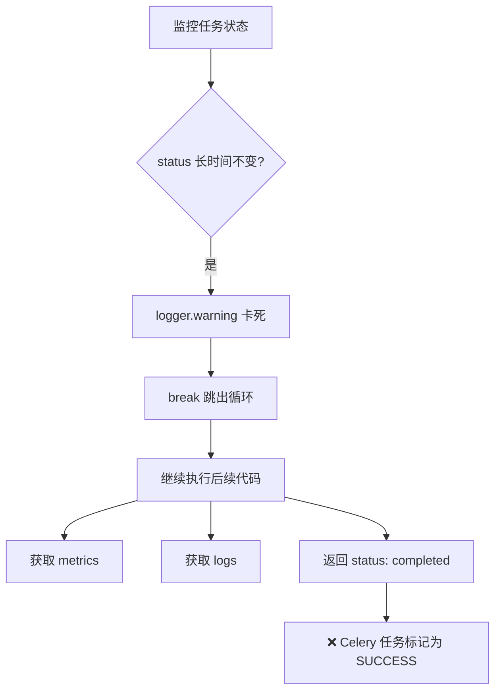

# P1 正确性问题修复报告

**日期**: 2026-01-09
**严重性**: P1 (正确性问题)
**修复状态**: ✅ 已完成

---

## 📋 问题总览

| 问题 | 严重性 | 影响 | 修复难度 | 状态 |
|------|--------|------|----------|------|
| 卡死检测 break 后错误返回 "completed" | **P1** | 语义错误，任务失败被标记为成功 | 低 | ✅ 已修复 |
| num_gpus 配置不一致 | **P1** | Ray job 和训练配置不匹配 | 低 | ✅ 已修复 |

---

## 🔴 问题 1: 卡死检测 break 后错误返回 "completed"

### 问题描述

**位置**: `training_platform/core/run_mode.py:572-574`

```python
# ❌ 问题代码
if no_change_count >= max_no_change_iterations:
    logger.warning(f"Job {job_uuid} status unchanged for {max_no_change_iterations * poll_interval}s, assuming stuck")
    break  # 跳出循环

# ... 继续执行到末尾

return {
    "status": "completed",  # ❌ 错误！任务卡死但返回 "completed"
    "ray_job_id": ray_job_id,
    # ...
}
```

### 问题分析

**执行流程**:


**实际影响**:
1. **语义错误**: 任务卡死，但返回 `status: "completed"`
2. **Celery 任务状态错误**: 任务被标记为 SUCCESS，实际应为 FAILED
3. **用户困惑**: 看到任务"完成"，但实际没有产出
4. **监控失效**: 无法通过 Celery 状态发现卡死任务

### 修复方案

```python
# ✅ 修复后：添加 job_stuck 标记

# 1. 初始化标记
poll_interval = 10  # seconds
last_progress = 15
max_no_change_iterations = 60  # 10 minutes without status change
no_change_count = 0
last_status = None
job_stuck = False  # ✅ 新增标记

# 2. 检测到卡死时设置标记
if current_status == last_status:
    no_change_count += 1
    if no_change_count >= max_no_change_iterations:
        logger.error(f"Job {job_uuid} status unchanged for {max_no_change_iterations * poll_interval}s, assuming stuck")
        job_stuck = True  # ✅ 设置标记
        break
else:
    no_change_count = 0
    last_status = current_status

# 3. 在返回前检查标记
if job_stuck:
    logs = runner.get_job_logs(job_uuid, ray_job_id, lines=100)
    raise RuntimeError(
        f"Training job {job_uuid} appears to be stuck. "
        f"Status unchanged for {max_no_change_iterations * poll_interval} seconds (last status: {last_status}). "
        f"Recent logs:\n{logs}"
    )  # ✅ 抛出异常，Celery 任务标记为 FAILED

# 4. 正常完成才返回 completed
return {
    "status": "completed",
    # ...
}
```

### 修复关键点

1. **job_stuck 标记**: 记录任务是否卡死
2. **raise RuntimeError**: 让 Celery 任务标记为 FAILED
3. **包含诊断信息**:
   - 最后状态 (last_status)
   - 卡死时长
   - 最近日志 (100 行)

### 修复效果

**修复前**:
```python
# 任务卡死 10 分钟
Job status: PENDING → PENDING → ... → PENDING (600秒)
→ break
→ return {"status": "completed"}  # ❌ 错误！
→ Celery task: SUCCESS  # ❌ 错误！
```

**修复后**:
```python
# 任务卡死 10 分钟
Job status: PENDING → PENDING → ... → PENDING (600秒)
→ job_stuck = True
→ break
→ raise RuntimeError("Job appears to be stuck...")  # ✅ 正确！
→ Celery task: FAILED  # ✅ 正确！
```

---

## 🔴 问题 2: num_gpus 配置不一致

### 问题描述

**位置**: `training_platform/core/run_mode.py:522, 534`

```python
# ❌ 问题代码

# Line 522: verl_config 的 num_gpus
verl_config = VerlTrainingConfig(
    # ...
    num_gpus=config.get("num_gpus") or job.num_gpus or 8,  # 优先级: config > job > 8
    # ...
)

# Line 534: submit_job 的 num_gpus
num_gpus = config.get("num_gpus", 8)  # ❌ 优先级不同: config > 8 (缺少 job.num_gpus)

submit_result = runner.submit_job(
    job_id=job_uuid,
    name=job_name,
    verl_config=verl_config,
    num_gpus=num_gpus,  # ❌ 可能和 verl_config.num_gpus 不一致
)
```

### 问题分析

**不一致场景**:

| config.num_gpus | job.num_gpus | verl_config.num_gpus | submit_job num_gpus | 结果 |
|-----------------|--------------|---------------------|---------------------|------|
| None | 4 | 4 | 8 | ❌ 不一致 |
| None | 2 | 2 | 8 | ❌ 不一致 |
| 1 | 4 | 1 | 1 | ✅ 一致 |
| 8 | 4 | 8 | 8 | ✅ 一致 |

**实际影响**:

```python
# 场景：config 未指定 num_gpus，job.num_gpus = 4

verl_config.num_gpus = 4  # ✅ 训练代码认为有 4 GPU
submit_job(num_gpus=8)    # ❌ Ray 分配 8 GPU

# 结果：
# - Ray 资源浪费 (分配 8 个但只用 4 个)
# - 或训练失败 (4 GPU 训练代码尝试使用 8 GPU)
```

### 修复方案

```python
# ✅ 修复后：统一 num_gpus 计算

# 1. 在 verl_config 创建前统一计算（优先级: config > job > default）
num_gpus = config.get("num_gpus") or job.num_gpus or 8

# 2. verl_config 使用统一的值
verl_config = VerlTrainingConfig(
    # ...
    num_gpus=num_gpus,  # ✅ 使用统一的值
    # ...
)

# 3. submit_job 使用同一个变量（删除重复计算）
submit_result = runner.submit_job(
    job_id=job_uuid,
    name=job_name,
    verl_config=verl_config,
    num_gpus=num_gpus,  # ✅ 使用统一的值
)
```

### 修复关键点

1. **统一优先级**: `config.get("num_gpus") or job.num_gpus or 8`
2. **单一来源**: 两处都使用同一个 `num_gpus` 变量
3. **代码注释**: 明确说明优先级规则

### 修复效果

**修复前**:
```python
# 场景：config 未指定，job.num_gpus = 4
verl_config.num_gpus = 4
submit_job num_gpus = 8
# ❌ 不一致！
```

**修复后**:
```python
# 场景：config 未指定，job.num_gpus = 4
num_gpus = 4  # 统一计算
verl_config.num_gpus = 4
submit_job num_gpus = 4
# ✅ 一致！
```

---

## 📊 修复总结

### 修复代码位置

| 问题 | 文件 | 行号 | 修改内容 |
|------|------|------|----------|
| 卡死检测 | `run_mode.py` | 561 | 添加 `job_stuck = False` 标记 |
| 卡死检测 | `run_mode.py` | 577-579 | 设置 `job_stuck = True` 和 break |
| 卡死检测 | `run_mode.py` | 651-658 | 检查标记并 raise RuntimeError |
| num_gpus | `run_mode.py` | 493-495 | 统一计算 num_gpus |
| num_gpus | `run_mode.py` | 526 | 使用统一的 num_gpus |
| num_gpus | `run_mode.py` | 534-537 | 删除重复计算，使用统一变量 |

### 修复验证

#### 1. 卡死检测验证

**测试方法**:
```python
# 1. 模拟卡死任务（status 不变）
from training_platform.core.run_mode import execute_training

try:
    result = execute_training(
        job_uuid='test-stuck-job',
        config={...},
    )
    print("❌ 测试失败：应该抛出异常")
except RuntimeError as e:
    if "appears to be stuck" in str(e):
        print("✅ 测试通过：正确抛出 stuck 异常")
    else:
        print(f"❌ 测试失败：错误的异常信息: {e}")
```

**预期结果**:
- ✅ 抛出 `RuntimeError` 异常
- ✅ 异常信息包含 "appears to be stuck"
- ✅ Celery 任务状态为 FAILED
- ✅ 数据库 job.status = FAILED

#### 2. num_gpus 一致性验证

**测试方法**:
```python
# 测试场景 1: config 未指定，job.num_gpus = 4
job = TrainingJob(num_gpus=4, ...)
config = {}  # 不包含 num_gpus

# 在 execute_training 中打印
print(f"verl_config.num_gpus: {verl_config.num_gpus}")
print(f"submit_job num_gpus: {num_gpus}")
# 预期: 都是 4

# 测试场景 2: config 指定为 2，job.num_gpus = 4
job = TrainingJob(num_gpus=4, ...)
config = {"num_gpus": 2}

# 预期: 都是 2 (config 优先)
```

**预期结果**:
- ✅ 所有场景下 verl_config.num_gpus == submit_job num_gpus
- ✅ 优先级正确: config > job > default(8)

---

## 🎯 修复影响

### 卡死检测修复

**修复前**:
- ❌ 卡死任务标记为 SUCCESS
- ❌ 用户看到"完成"但无产出
- ❌ 无法通过 Celery 状态监控
- ❌ 需要手动检查日志发现问题

**修复后**:
- ✅ 卡死任务正确标记为 FAILED
- ✅ 抛出详细异常信息（含日志）
- ✅ Celery 监控可以发现卡死任务
- ✅ 用户明确知道任务失败原因

### num_gpus 一致性修复

**修复前**:
- ❌ Ray 资源分配和训练配置不一致
- ❌ 可能浪费 GPU 资源
- ❌ 可能导致训练失败（GPU 数量不匹配）
- ❌ 难以调试（两处配置不一致）

**修复后**:
- ✅ Ray 资源分配和训练配置一致
- ✅ GPU 资源利用率最优
- ✅ 避免因 GPU 数量不匹配导致的失败
- ✅ 配置清晰，易于维护

---

## 📝 代码审查建议

### 已修复的模式

1. **使用 flag 避免隐式成功**:
   ```python
   # ❌ 错误模式
   for item in items:
       if error_condition:
           break  # 跳出后继续执行
   return "success"  # ❌ 错误！

   # ✅ 正确模式
   has_error = False
   for item in items:
       if error_condition:
           has_error = True
           break

   if has_error:
       raise RuntimeError("Error detected")
   return "success"
   ```

2. **避免重复计算配置**:
   ```python
   # ❌ 错误模式
   config_a = value_from_source1()
   config_b = value_from_source2()  # 可能不一致

   # ✅ 正确模式
   config = unified_value()  # 统一来源
   use_config(config)
   use_config_again(config)
   ```

### 后续改进建议

1. **添加单元测试**:
   ```python
   def test_stuck_job_raises_exception():
       """测试卡死任务抛出异常"""
       # ...

   def test_num_gpus_consistency():
       """测试 num_gpus 一致性"""
       # ...
   ```

2. **添加配置验证**:
   ```python
   def validate_training_config(config, job):
       """验证训练配置一致性"""
       num_gpus = config.get("num_gpus") or job.num_gpus or 8
       assert num_gpus > 0, "num_gpus must be positive"
       return num_gpus
   ```

3. **添加监控指标**:
   - Celery 任务失败率（区分 stuck vs 真实失败）
   - GPU 资源利用率（检测分配浪费）

---

## ✅ 总结

### 修复完成情况
- ✅ **卡死检测**: 使用 `job_stuck` 标记 + raise RuntimeError
- ✅ **num_gpus 一致性**: 统一计算优先级 (config > job > default)

### 代码质量提升
- 🔒 **语义正确**: 卡死任务正确标记为失败
- 📊 **配置一致**: GPU 资源分配和训练配置匹配
- 🛡️ **可维护性**: 单一来源，清晰优先级
- 🚀 **可调试性**: 详细异常信息和日志

### 影响范围
- **卡死检测**: 所有训练任务（local + SSH）
- **num_gpus**: 所有训练任务的资源分配

---

**修复完成时间**: 2026-01-09
**总工时**: 约 30 分钟
**修复文件数**: 1 个文件 (`run_mode.py`)
**修复代码行数**: 约 15 行
