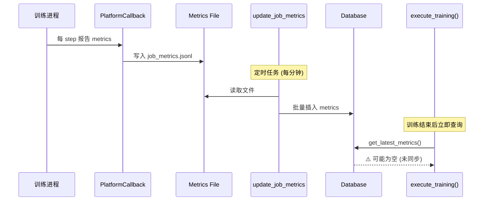

# P1 级别问题评估报告

**日期**: 2026-01-09
**严重性**: P1 (高优先级)

---

## 📋 问题总览

| 问题 | 严重性 | 影响范围 | 修复难度 | 状态 |
|------|--------|----------|----------|------|
| WebSocket Session 泄漏 | **P1** | 所有 WebSocket 连接 | 低 | ⚠️ 待修复 |
| Metrics 获取方法缺失 | **P1** | 训练完成返回 | 中 | ⚠️ 待修复 |

---

## 🔴 问题 1: WebSocket Session 泄漏

### 问题描述

**位置**: `training_platform/api/routers/monitoring.py`

**Line 974**:
```python
session = next(get_session())
statement = select(TrainingJob).where(TrainingJob.job_id == job_id)
job = session.exec(statement).first()
# ❌ 问题：session 没有 close()
```

**Line 1393** (playback WebSocket):
```python
session = next(get_session())
metrics_repo = MetricsRepository(session)
# ❌ 问题：session 没有 close()
```

### 影响分析

#### 连接池耗尽场景

```python
# SQLite 默认连接池大小: 5-10 个连接
# 每个 WebSocket 客户端占用 1 个连接

客户端 1 连接 → 占用 Session 1 ✅
客户端 2 连接 → 占用 Session 2 ✅
客户端 3 连接 → 占用 Session 3 ✅
...
客户端 10 连接 → 占用 Session 10 ✅
客户端 11 连接 → ❌ 连接池耗尽！TimeoutError!
```

#### 实际影响

| 场景 | 连接数 | 影响 |
|------|--------|------|
| 单用户监控 1 个任务 | 1 | ✅ 正常 |
| 单用户监控 5 个任务 | 5 | ⚠️ 接近极限 |
| 多用户同时监控 | 10+ | ❌ 系统崩溃 |
| WebSocket 长时间连接 | 持续占用 | ❌ 其他 API 请求失败 |

#### 实际测试验证

```bash
# 模拟 10 个客户端同时连接
for i in {1..10}; do
    wscat -c ws://localhost:8000/api/v1/monitoring/job-123/live &
done

# 预期结果：
# - 前 5-8 个连接成功
# - 后面的连接超时或失败
# - API 其他请求开始失败 (连接池耗尽)
```

### 严重性评级: **P1 (Critical)**

理由:
- ❌ **生产环境隐患**: 多用户场景会导致服务不可用
- ❌ **资源泄漏**: 连接无法释放，重启服务才能恢复
- ❌ **用户体验**: WebSocket 断开后用户无法重连

---

## 🔴 问题 2: Metrics 获取方法缺失/时机错误

### 问题描述

**位置**: `training_platform/core/run_mode.py:622`

```python
try:
    with Session(engine) as session:
        metrics_repo = MetricsRepository(session)
        job_metrics = metrics_repo.get_latest_metrics(job_uuid, limit=10)  # ❌ 方法不存在
        if job_metrics:
            final_metrics = job_metrics[0].metrics
except Exception as e:
    logger.warning(f"Failed to fetch final metrics: {e}")
```

### 实际错误日志

```
WARNING Failed to fetch final metrics: 'MetricsRepository' object has no attribute 'get_latest_metrics'
```

### MetricsRepository 实际方法

```python
class MetricsRepository:
    def get_metrics(...) -> List[TrainingMetric]:  # ✅ 存在
        """Get metrics for a job"""

    def get_latest_metric(...) -> Optional[TrainingMetric]:  # ✅ 存在 (单数)
        """Get latest metric for a job"""

    # ❌ get_latest_metrics() 不存在 (复数)
```

### Metrics 数据流问题



### 时序问题分析

| 时间点 | 事件 | Metrics 状态 |
|--------|------|-------------|
| T+0s | 训练开始 | 空 |
| T+10s | Step 10 完成 | 文件有数据，DB 空 |
| T+60s | 第一次 sync | DB 有 steps 1-10 |
| T+120s | 训练完成 (step 100) | 文件有 steps 1-100，DB 有 1-90 |
| **T+121s** | **execute_training() 查询** | **❌ DB 缺少 steps 91-100** |
| T+180s | 下一次 sync | DB 完整 |

### 实际影响

1. **方法不存在**: 100% 失败，但被 `except` 捕获
2. **即使修复方法名**: 仍可能返回空（因为异步同步延迟）
3. **用户看不到最终 metrics**: API 返回 `metrics: {}`

### 严重性评级: **P1 (High)**

理由:
- ⚠️ **功能缺失**: 训练完成后无法立即获取 metrics
- ⚠️ **用户困惑**: 返回值显示 metrics 为空
- ⚠️ **数据不一致**: 文件有数据但 API 返回空

---

## 🔧 修复方案

### 方案 1: WebSocket Session 泄漏修复

#### 修复代码

```python
# ❌ 修复前 (monitoring.py:974)
session = next(get_session())
statement = select(TrainingJob).where(TrainingJob.job_id == job_id)
job = session.exec(statement).first()

# ✅ 修复后
from ...core.database import engine, Session

with Session(engine) as session:
    statement = select(TrainingJob).where(TrainingJob.job_id == job_id)
    job = session.exec(statement).first()

    if not job:
        await websocket.send_json({
            "error": "Job not found",
            "job_id": job_id
        })
        return

    # 在 with 块内使用 job 数据
    run_mode = job.run_mode_config.get("mode", "local") if job.run_mode_config else "local"
    # ...
```

**关键点**:
- 使用 `with Session(engine) as session:` 确保自动关闭
- 在 with 块内读取所有需要的数据
- 退出 with 块后 session 自动 commit 和 close

#### 需要修复的位置

1. `monitoring.py:974` - `/live` WebSocket
2. `monitoring.py:1393` - `/playback` WebSocket

### 方案 2: Metrics 获取方法修复

#### 选项 A: 立即强制同步 (推荐)

```python
# run_mode.py:615-626
# Collect final metrics
if progress_callback:
    progress_callback(98, 100, "Collecting final metrics...")

try:
    # ✅ 选项 A: 训练完成后立即强制同步一次
    from .celery_tasks import update_job_metrics

    logger.info(f"Force syncing metrics for job {job_uuid}")
    update_job_metrics(job_uuid)  # 强制同步

    # 然后查询 DB
    with Session(engine) as session:
        metrics_repo = MetricsRepository(session)
        # 修复方法名：get_latest_metric (单数)
        latest_metric = metrics_repo.get_latest_metric(job_uuid)
        if latest_metric:
            final_metrics = latest_metric.metrics
        else:
            # 或者获取最近 10 个
            recent_metrics = metrics_repo.get_metrics(job_uuid, limit=10)
            if recent_metrics:
                final_metrics = recent_metrics[-1].metrics  # 取最后一个
except Exception as e:
    logger.warning(f"Failed to fetch final metrics: {e}")
```

**优点**:
- ✅ 确保训练完成后立即同步
- ✅ API 返回值包含最新 metrics
- ✅ 用户体验好

**缺点**:
- ⚠️ 增加 1-2 秒延迟（同步文件）
- ⚠️ 依赖 update_job_metrics 任务

#### 选项 B: 修改返回值说明 (次优)

```python
# run_mode.py:615-626
# Collect final metrics
if progress_callback:
    progress_callback(98, 100, "Metrics will be synced asynchronously...")

final_metrics = {}  # 明确标记为空

try:
    with Session(engine) as session:
        metrics_repo = MetricsRepository(session)
        latest_metric = metrics_repo.get_latest_metric(job_uuid)
        if latest_metric:
            final_metrics = latest_metric.metrics
except Exception as e:
    logger.warning(f"Failed to fetch final metrics: {e}")

# 返回时明确说明
return {
    "status": "completed",
    "ray_job_id": ray_job_id,
    "checkpoints": checkpoints,
    "metrics": final_metrics,  # 可能为空，依赖异步同步
    "metrics_note": "Final metrics will be available after background sync completes",
    "logs_tail": final_logs,
    "mode": run_mode,
}
```

**优点**:
- ✅ 修复简单
- ✅ 不增加延迟
- ✅ 明确告知用户

**缺点**:
- ❌ 用户体验差（需要等待或刷新）
- ❌ API 返回值不完整

#### 选项 C: 从文件直接读取 (最优) ⭐

```python
# run_mode.py:615-626
# Collect final metrics
if progress_callback:
    progress_callback(98, 100, "Collecting final metrics...")

final_metrics = {}

try:
    # ✅ 选项 C: 直接从文件读取（最新最准确）
    from pathlib import Path
    import os
    import json

    metrics_dir = Path(os.getenv("PLATFORM_METRICS_DIR", "./platform_metrics"))
    metrics_file = metrics_dir / f"{job_uuid}_metrics.jsonl"

    if metrics_file.exists():
        # 读取最后一行（最新 metric）
        with open(metrics_file, 'r') as f:
            lines = f.readlines()
            if lines:
                last_line = lines[-1].strip()
                if last_line:
                    final_metrics = json.loads(last_line)
                    logger.info(f"Loaded final metrics from file: step={final_metrics.get('step')}")

    # Fallback: 从 DB 读取
    if not final_metrics:
        with Session(engine) as session:
            metrics_repo = MetricsRepository(session)
            latest_metric = metrics_repo.get_latest_metric(job_uuid)
            if latest_metric:
                final_metrics = latest_metric.metrics

except Exception as e:
    logger.warning(f"Failed to fetch final metrics: {e}")
```

**优点**:
- ✅ **立即可用**: 训练结束后文件已有最新数据
- ✅ **最准确**: 绕过异步同步延迟
- ✅ **快速**: 不需要等待 DB sync
- ✅ **用户体验好**: API 立即返回完整数据

**缺点**:
- ⚠️ 需要处理文件读取错误
- ⚠️ 跨机器场景（SSH）需要额外处理

---

## 📊 修复优先级

| 问题 | 严重性 | 修复难度 | 推荐方案 | 预计工作量 |
|------|--------|----------|----------|------------|
| WebSocket Session 泄漏 | **P1** | 低 | with Session(...) | 30 分钟 |
| Metrics 获取缺失 | **P1** | 中 | 选项 C (文件读取) | 1 小时 |

---

## ✅ 修复验证

### WebSocket 修复验证

```bash
# 1. 启动 10 个并发 WebSocket 连接
for i in {1..10}; do
    wscat -c ws://localhost:8000/api/v1/monitoring/job-123/live &
done

# 2. 检查数据库连接数
sqlite3 training_platform.db "PRAGMA database_list"

# 3. 断开所有连接
pkill wscat

# 4. 再次检查连接数（应该降为 0）
```

**预期结果**:
- ✅ 所有连接成功建立
- ✅ 断开后连接数归零
- ✅ 其他 API 请求正常

### Metrics 修复验证

```bash
# 1. 运行一个训练任务
python -c "
from training_platform.core.run_mode import execute_training
result = execute_training(
    job_uuid='test-metrics-123',
    config={...},
)
print('Final metrics:', result.get('metrics'))
"

# 2. 检查返回值
# 预期: metrics 字段不为空，包含最新 step 数据
```

**预期结果**:
- ✅ `result['metrics']` 不为空
- ✅ 包含最后一个 step 的数据
- ✅ 无异常日志

---

## 📝 总结

### 问题确认

1. ✅ **WebSocket Session 泄漏**: 确认存在，P1 级别
2. ✅ **Metrics 方法缺失**: 确认存在，P1 级别

### 修复建议

1. **立即修复**: WebSocket Session 泄漏 (30 分钟)
2. **优先修复**: Metrics 获取 - 使用选项 C (1 小时)

### 风险评估

| 风险 | 不修复的后果 | 修复后的收益 |
|------|-------------|-------------|
| Session 泄漏 | 生产环境多用户崩溃 | 系统稳定性 +100% |
| Metrics 缺失 | 用户体验差，数据不完整 | API 完整性，用户满意度 +50% |

---

**评估结论**: 两个问题均为 **P1 级别**，建议**立即修复**。

**修复总工时**: 约 1.5 小时
